# Hotel-Database

REST API dla hotelu, by umożliwić m.in. rezerwacje pokoi oraz usług poprzez np. formularz internetowy. Użytkownik miałby możliwość stworzenia konta za pomocą, którego dokonywałby rezerwacji, przeglądał historie rezerwacji i je oceniał.

Użytkownicy mają przypisane role, które umożliwiają im dostęp do poszczególnych opcji (admin/pracownik/klient).

Użyte technologie: Express, Mongoose. MongoDB, JWT

Skład grupy: Rafał Kamiński, Marcin Kozub, Barbara Gaweł-Kucab  

---

 ### Zasady działania:
 * wygląd strony dla niezalogowanego użytkownika. Każdy z pokoi ma swoją ocenę, oceny są dodawane przez użytkowników, którzy zarezerwowali dany pokój. Ocena to liczba całkowita z zakresu 1-5. Na podstawie wszystkich ocen jest obliczana średnia ocena pokoju. Na stronie znajduje się kilka dostępnych rodzajów pokoi, każdy z nich ma ograniczoną liczbę jaka jest dostępna w danym momencie

 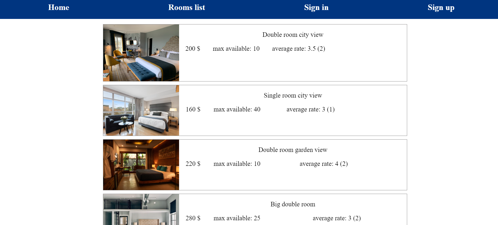

  GET - RATING
  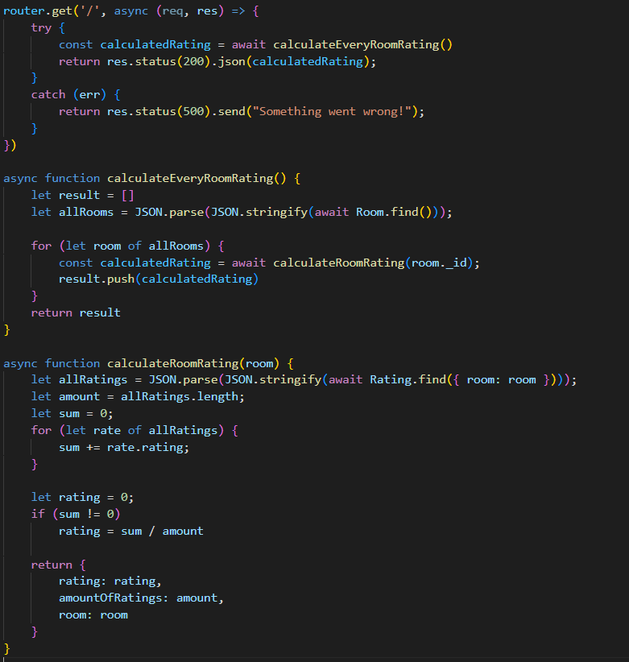

 * użytkownik może się zalogować/stworzyć konto - [autentykacja](#Autentykacja)

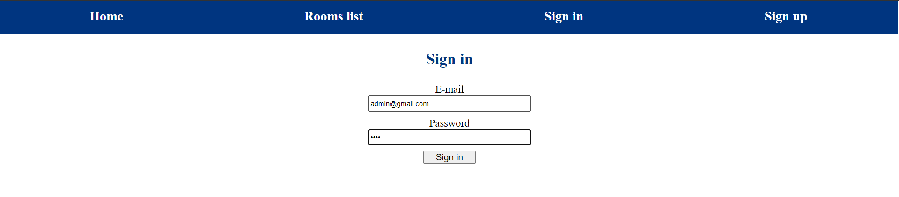

* po zalogowaniu użytkownik może rezerwować zarezerwować. Rezerwacja musi być stworzona dla wybranej daty w pryszłości oraz ilość rezerwacji na dany pokój w danym terminie nie może przekroczyć maksymalnej liczby dostępnych pokoi. Gdyby jeden z podanych warunków nie był spełniony to rezerwacja się nie powiedzie.

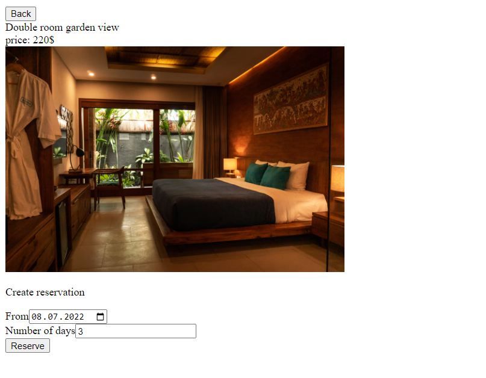

POST - RESERVATION
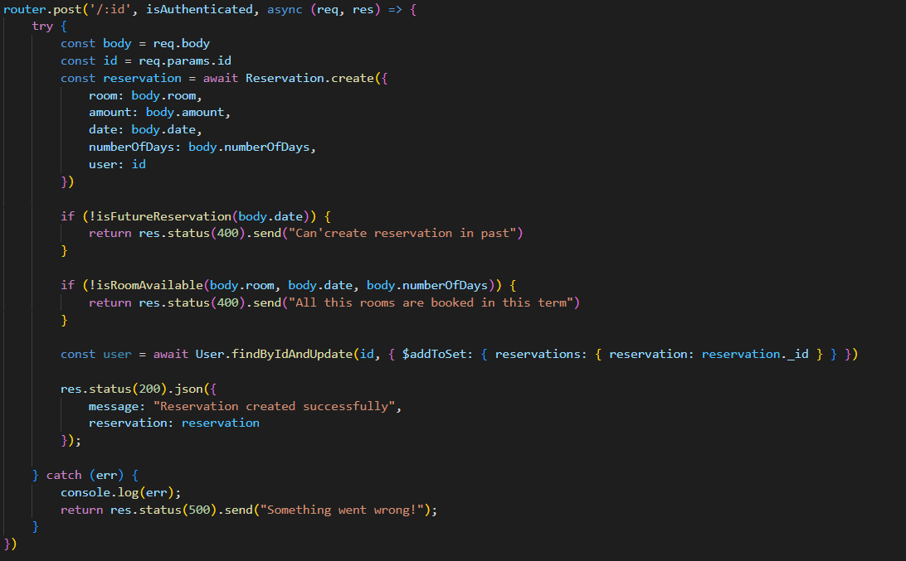

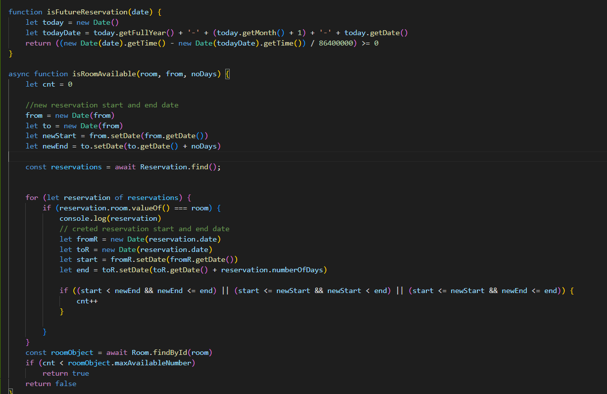

* każdy użytkownik ma dostęp do historii swoich rezerwacji (posortowaych po dacie rozpoczęcia rezerwacji). Może je oceniać (tylko raz) oraz usuwać

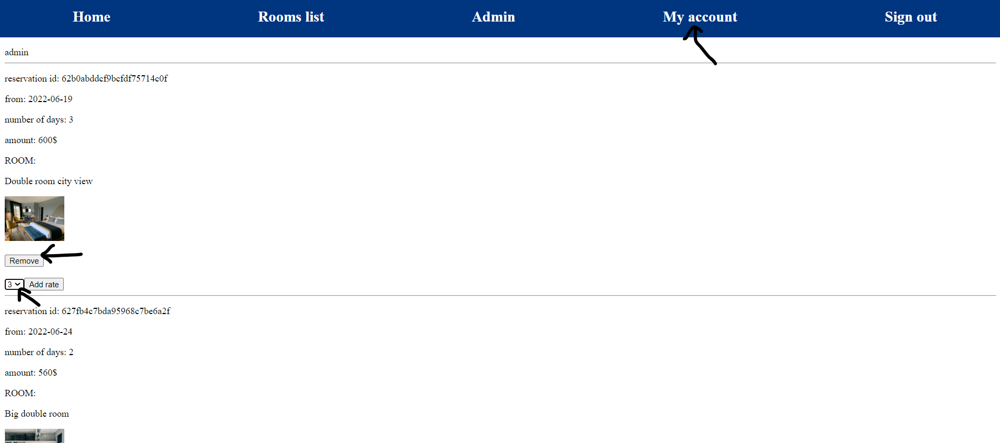

POST - RATING
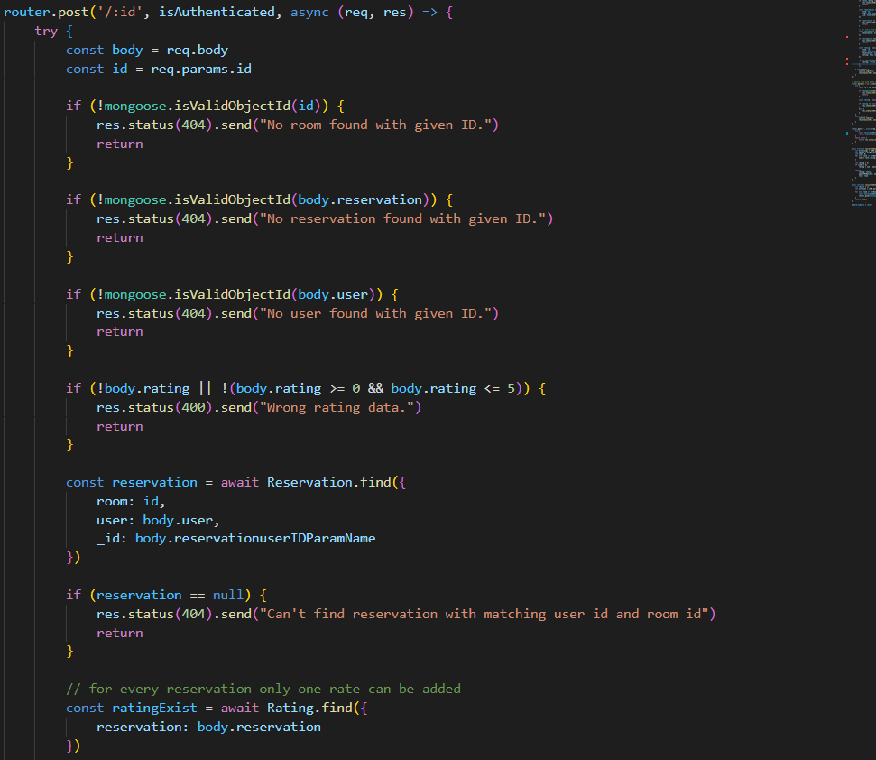
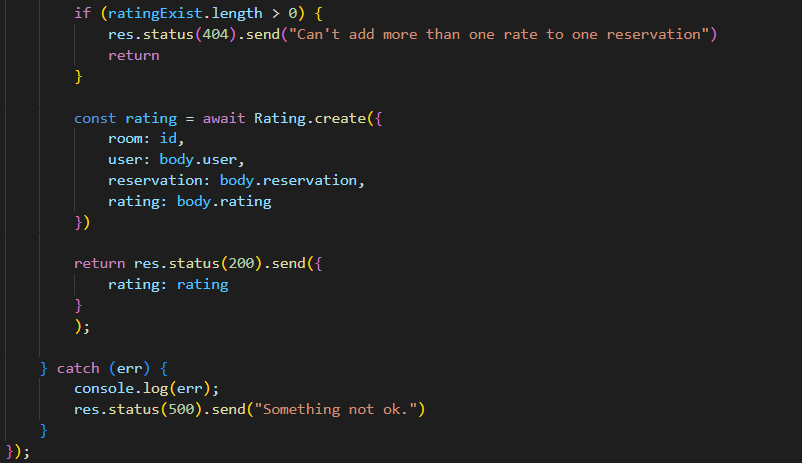

GET - RESERVATION
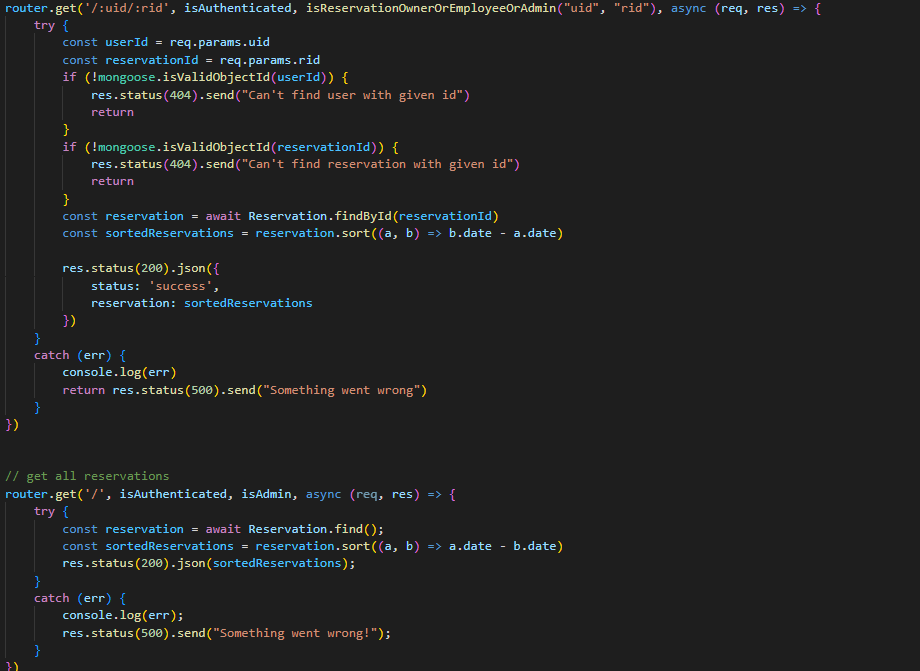

DELETE - RESERVATION
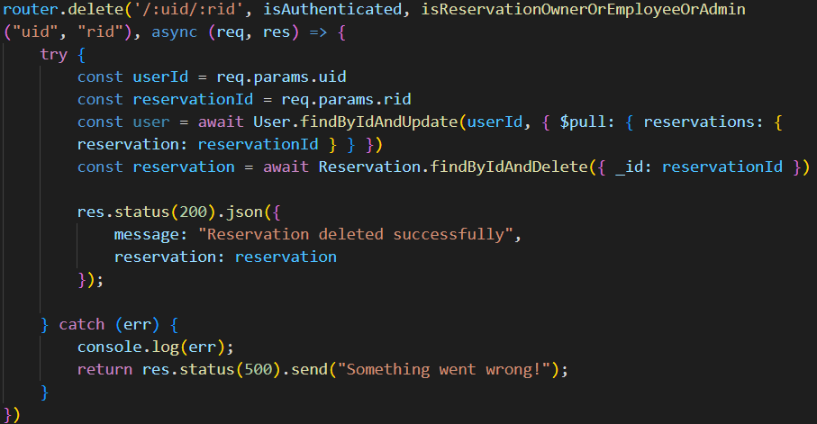

* administrator posiada dodatkowe opcje
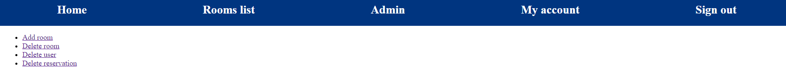

  *  dodawanie pokoi
  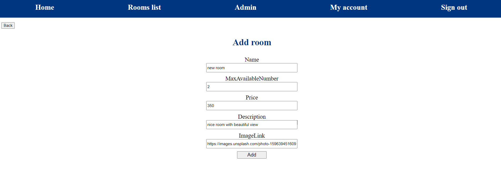
  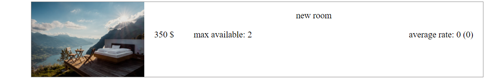

  POST - ROOM
  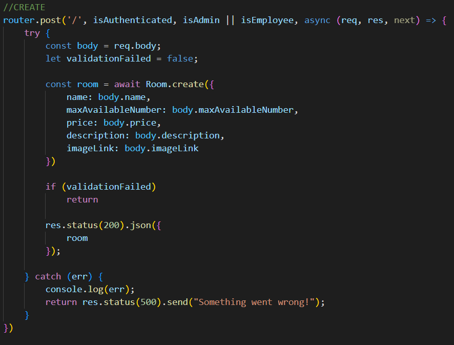

  * usuwanie pokoi 
    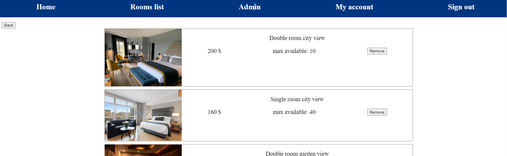

    DELETE - ROOM
    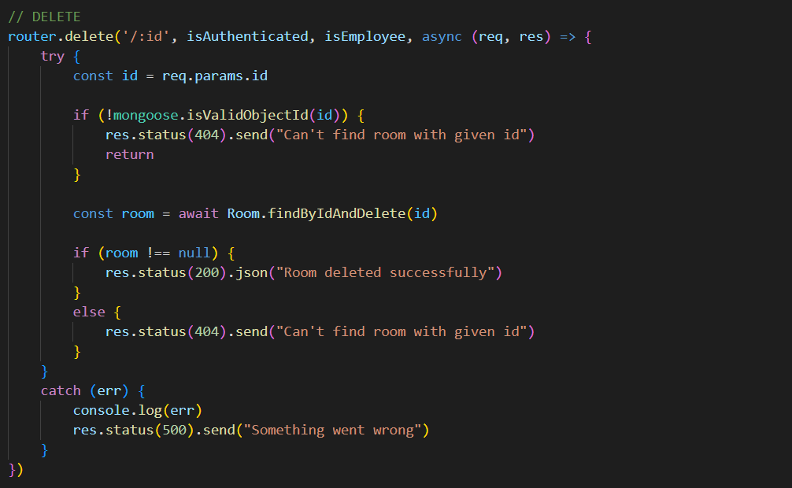

  * usuwanie użytkowników
      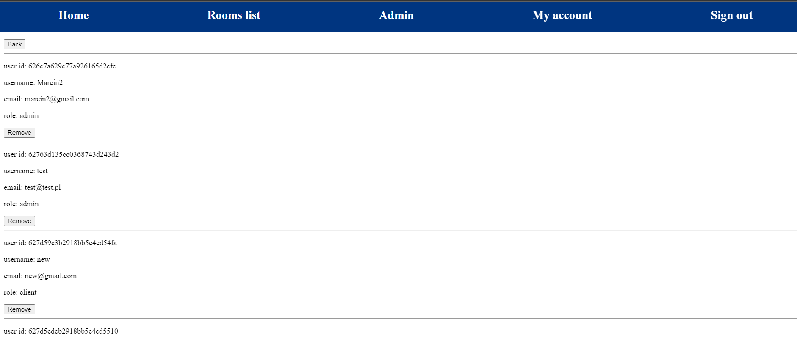

      DELETE - USER
      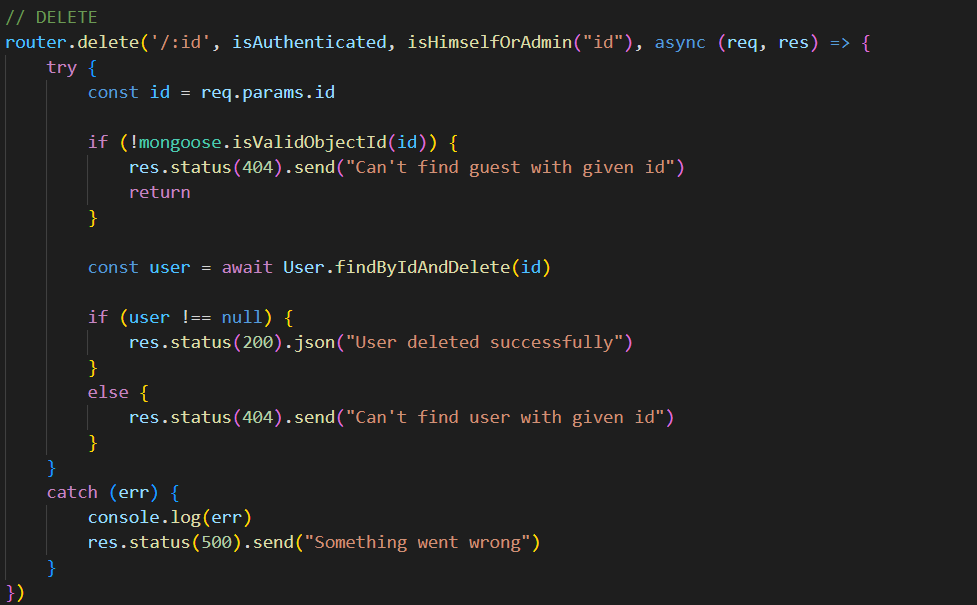

  * usuwanie wszystkich dostępnych rezerwacji
      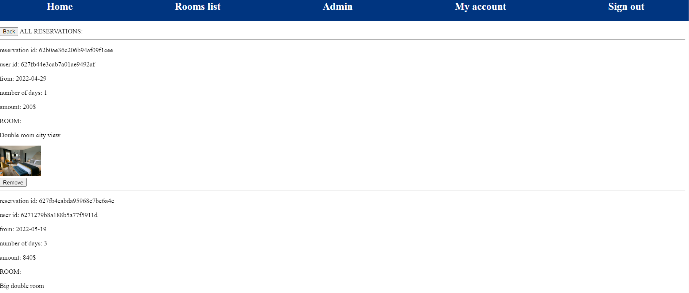

    

 ### Struktury danych w bazie:
 * user
 
 
 
 
 * room
 
  
  
  
 * reservation
 
 
 
 
 * rating
 
  
  
  
 * log
 
 
 
 
 * refresh token
 
  

---

 ### 
Autentykacja

* register

* login

* token refresh

* funkcje dla tokena

---

 ### Dodatkowe endpointy
 
 <!-- jest wyżej -->
<!-- * CREATE Reservation

 -->

<!-- * READ --- todo -->

* UPDATE Reservation

 <!-- jest wyżej -->

<!-- * DELETE Reservation

 -->
